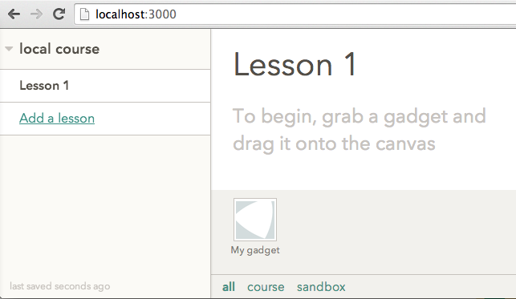
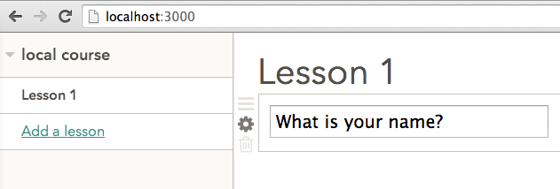
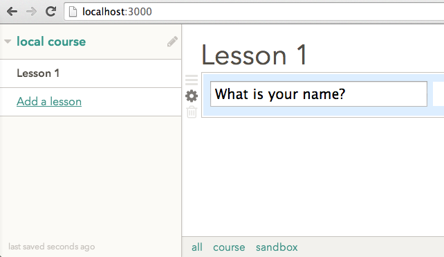
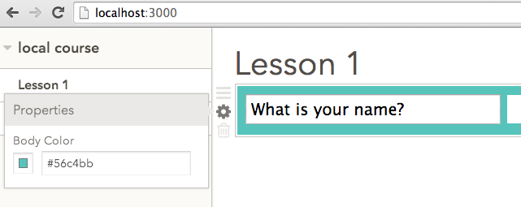
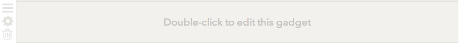
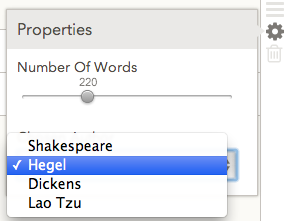

# Intro

Welcome to Versal's gadget documentation! Here you'll find everything needed to get started building rich learning tools on the Versal platform. Please see the **Support** section if you have any questions that aren't answered here!

## What you need to know

* JavaScript, HTML5, CSS
* Web development / debugging tools, such as Chrome dev tools
* Basics of the Unix command line

# Overview and concepts

## The Versal platform

Versal is a platform for creating online learning experiences. If a person knows something, wants to teach it, and is technically savvy enough to post on Wordpress or Facebook, they’ll be able to author a **course** and publish it on Versal.

A Versal course consists of **lessons**. Each lesson can contain many different types of content - from text, images, and videos, to rich interactive elements. In a Versal lesson, all these elements are implemented as single-page apps, called **gadgets**.

Some gadgets are very simple - for instance, just showing a paragraph of formatted text. Other gadgets may present interactive graphics or a quiz to the learner. Course authors can create rich interactive experiences for the learners by selecting gadgets specially adapted to the subject matter of the course.

The Versal platform makes it easy for course authors to use such gadgets in their courses, without need for any coding. The authors will simply assemble their lessons from the available gadgets by dragging and dropping them into a lesson within the Versal **course player**. The course player is an online authoring/learning environment where authors can edit their course content and learners can interact with courses.

## Gadgets and lessons

Gadgets can be created by third-party gadget developers and published to the Versal platform. The Versal platform provides essential tools and utility libraries so that gadget developers can better focus on building interactive learning experiences.

Because gadgets are custom-programmed, there is no limit to what you can do as a gadget developer. You can use any JavaScript libraries and frameworks, communicate with any third-party Web servers, and access the Versal platform services for tasks such as image or video uploading or persisting learner's data.

Technically, a gadget can be any application that runs in a Web browser. A gadget's scope might be very small and focused and only useful for a narrow subject, or it can be widely applicable to any subject. Some example gadgets:

* a set of flashcards

* an interactive simulation of the human heart

* a game that teaches how to program

* an interactive quiz or test

* a Google document embedded in a lesson

Lessons are structured as a vertical sequence of gadgets. When an author starts editing a course, each lesson is initially a blank canvas where gadgets can be added, configured, and rearranged.

Lessons can be divided into sections by placing a section header gadget into the lesson. Header gadgets also allow the player to generate a navigable table of contents for each lesson.

## Authors and learners

An **author** creates content in a course: drags gadgets into the lesson, then enters text, uploads images, selects questions for a quiz, etc. From the viewpoint of the gadget developer, the author _configures_ each of the gadgets in a lesson. The configuration for each gadget instance is stored in the **attributes** of that instance.

Each lesson may contain several **instances** of the same kind of gadget (for example, several image gadgets). Of course, each gadget instance has its own configuration and is independent of other gadget instances.

A **learner** can view the course content and interact with it, but cannot change the attributes configured by the author. Some gadgets may need to save the results of the learner's interaction with the gadget's UI (for example, save the last selected item). The Versal platform saves this information as the **learner's state**, which is separate for each learner and each gadget instance.

Typically, an author will first create an empty gadget in a lesson, edit the gadget's configuration, and then check the learner's view of the gadget. So each gadget should provide a consistent user experience both for authors and for learners.

## How gadgets work

A gadget is a single-page app that lives inside an `iframe`. The `iframe` for each gadget will be created automatically by the Versal player whenever a lesson is loaded.

The gadget communicates with the course player via events sent over a `postMessage` based event bus. Gadgets use this API to perform four basic functions:

* get and set persistent gadget configuration data: the attributes (configured by the course author) and the learner state (for each learner)
* let the authors upload images and videos to the Versal platform
* use some standard visual features of the Versal course player ("empty gadget" and "gadget error" views, property sheets, and asset upload dialog)
* store question/answer data and perform scoring (for quizzes and other challenges)

More details about the lifecycle of the gadget are found in the **Reference guide**

It is recommended for gadget developers to use `player-api`, which is a convenience library that hides the need for `postMessage` and provides some other useful functions (see below).

# Tutorial

One needs only a few steps to build a basic gadget. Begin by installing the Versal SDK if you have not done so already.

      $ npm install -g versal-sdk

Verify that the Versal SDK was installed:

      $ versal --version
      1.6.1

See [installation help](https://github.com/Versal/sdk#installation-in-depth) if you have problems at this step.

## Creating a new gadget project

This command will create a new directory called `my-gadget`:

      $ versal create my-gadget

The `my-gadget` directory now contains the gadget manifest (`versal.json`), the main gadget file (`versal.html`), an icon, and a `bower.json` configuration file.

## Testing the new gadget

The newly created gadget is fully operational. To test it, run `versal preview` in the gadget directory:

      $ cd my-gadget
      $ versal preview

Now open the url [localhost:3000](http://localhost:3000) in a Web browser. You will see a Versal course player, which provides an editing environment with an empty lesson and a gadget below.



Double-click on the gadget to add it to the lesson. You should see your working gadget:



The gadget shows a question and an answer. The course author can edit the question text. (You can click on the question text to start editing it, since you are the author of this "course".) The learner can enter an answer.

## Make and preview changes

While the preview is running, let us examine the gadget code in `versal.html`. It is self-contained and consists of a simple CSS style sheet and a small JavaScript snippet:

```
<script>
var greeting = document.querySelector('[name=greeting]');
var learnerName = document.querySelector('[name=learnerName]');
var player = new VersalPlayerAPI();

greeting.addEventListener('change', function(e){
  player.setAttribute(greeting.name, greeting.value);
});

learnerName.addEventListener('change', function(e){
  var attrs = {};
  attrs[learnerName.name] = learnerName.value;

  player.setLearnerState(attrs);
});

player.on('attributesChanged', function(data){
  if(data.greeting) {
    greeting.value = data.greeting;
  };
});

player.on('learnerStateChanged', function(data){
  if(data.learnerName) {
    learnerName.value = data.learnerName;
  };
});

player.on('editableChanged', function(editable){
  greeting.readOnly = !editable.editable;
  learnerName.readOnly = editable.editable;
});

player.setHeight(60);
player.startListening();
</script>
```

Let's set a background color on the gadget. Add these lines to the `<style>` tag in `versal.html`:

      body {
        background-color: #def;
      }

Now reload the browser window where you opened the preview. You will see the changed gadget:



In this way, you can preview your new gadget code as you are developing it.

## How this gadget works

The gadget uses the `player-api` module to interact with the Versal course player. There is only one attribute, `greeting`, and only one learner's attribute, `learnerName`. The listeners `on('attributesChanged')` and `on('learnerStateChanged')` will fire when the player sends these attributes to the gadget. When any of these values are modified, the gadget persists them by sending the messages `setAttribute` and `setLearnerState` to the player API.

The message `editableChanged` is sent when the author toggles the editing mode on the gadget. In this simple gadget, it is sufficient to toggle the editable state on the `input` elements.

## Add a configurable color

Let's add a new feature to the gadget, so that the author can set the background color. The color will be stored as a new attribute `bodyColor` in the gadget configuration.

To let the gadget author edit the color, we use a **property sheet**. This is a feature of the player that is convenient for editing simple attributes.

We need to make only two changes to the gadget code:

1. Configure the property sheet
2. Set the background color on `attributesChanged`

To configure the property sheet, we just need to add a call to the player API (anywhere after creating the `player` object):

```
player.setPropertySheetAttributes({
     bodyColor:  { type: 'Color'}
});
```

To set the background color, we modify the `attributesChanged` handler like this:

```
player.on('attributesChanged', function(data){
  if(data.greeting) {
    greeting.value = data.greeting;
  }
  if (data.bodyColor) {
    document.querySelector('body').style.background = data.bodyColor;
  }
});
```

Now reload the browser window with the gadget. Click on the cogwheel icon to open the property sheet. You can now select a color:





## Publish the gadget

When you are ready to publish the gudget to the Versal platform, use these commands:

      $ versal signin

(This is necessary only once, your Versal credentials will be saved on your local machine.)

      $ versal publish

This will upload your gadget to the Versal platform. You can now create a new course on Versal and use your new gadget!

# Reference guide

## The layout of a gadget project

The Versal platform provides a **course player** environment that loads the gadget in the context of a lesson, passes configuration data to the gadget, and receives learner's data from the gadget.

Presently, a gadget is developed as a Web app - that is, as an individual HTML document. The player will first load the gadget's root file, `versal.html`. Any JavaScript libraries or frameworks required by the gadget need to be loaded there by usual mechanisms supported by HTML5 (statically or asynchronously). The gadget's JavaScript code should be loaded and started from this `versal.html`.

In addition, each gadget must have an icon, `assets/icon.png`, and a `versal.json` that specifies the gadget's name, current version, the Versal user who developed it, and other data.

The command

    versal create test1

will create a new minimal gadget project in the subdirectory `test1`. The project will contain just three files, `versal.html`, `assets/icon.png`, and `versal.json`.

The layout of `versal.json` is clear from this example (see [versal.json](https://github.com/Versal/hello-world-gadget/blob/master/versal.json) ):

```
{
  "name": "hello-world",  // short name of gadget
  "version": "0.1.1",   // semantic version
  "title": "Hello, World",
  "description": "Demo gadget showing the basic API",
  "author": "versal",   // username on Versal.com
  "launcher": "iframe",  // specifies the gadget launcher, must be "iframe" for now
  "defaultConfig": {  // default set of attributes for the gadget
    "chosenColor" : "#00cc00",
    "chosenWord" : "green"
  },
  "defaultUserState": { // default learner state for the gadget
    "isBold": false
  }
}
```

The command `versal upload` needs to be run in the root of the gadget project directory. It will package _all_ files in the gadget project directory and upload them to the Versal platform. It is advisable to keep in this project directory only the files that are required for the gadget at run time. Put all other files (for example, Coffeescript source files, documentation, or other data) in some other directory, not under the gadget project directory.

## The gadget lifecycle

### Gadget/player messaging

The player communicates with the gadget through a `postMessage`-based message bus. The recommended way is to use the `player-api` module, which hides the low-level details of `postMessage` communication. If you wish you may consult the detailed documentation about the [gadget messaging API](https://github.com/Versal/versal-gadget-launchers/blob/master/iframe-launcher/README.md). However, the [player-api module](https://github.com/Versal/versal-gadget-api/blob/master/README.md#versal-player-apijs) is more convenient and sufficient for all purposes.

#### Installation of `player-api`

This module is part of the Versal gadget API. Include this as a Bower dependency:

    bower install --save versal-gadget-api

If you are using Web components, include the `player-api` into your main HTML document like this:

    <link rel="import" href="bower_components/versal-gadget-api/versal-gadget-api.html">

The recommended way of using Web components is to include this polyfill,

    bower install --save webcomponentsjs

If you are not using Web components, include these files:

    <script src="bower_components/eventEmitter/EventEmitter.js"></script>
    <script src="bower_components/versal-gadget-api/versal-player-api.js"></script>

#### Sending and receiving messages

When your gadget code is loaded, create a new `player-api` object:

    var playerApi = new VersalPlayerAPI();

To receive messages from the player, add a listener to the player object, for example like this:

    playerApi.on('attributesChanged', function(attrs){
      // do something
    });

To send messages to the player, call a method on the `player-api` object, for example:

    // send this command to receive initial events
    playerApi.startListening();

The supported messages and their JSON formats are documented in the repository [Versal/versal-gadget-api](https://github.com/Versal/versal-gadget-api/blob/master/README.md#versal-player-apijs). Here we will describe how gadgets use these messages to communicate with the player.

### Gadget configuration

When the gadget code is first loaded, the gadget is not yet attached to a DOM node in the lesson document. At this point, the gadget should initialize itself, so that it is ready to receive its current configuration data. Then the gadget should send the player a `startListening` message. The player will respond by sending messages that give the gadget its configuration data.

Keep in mind that the Versal platform expects the same gadget code to implement the learner's UX and the additional editing UX.
To aid this separation of concerns, the gadget configuration data has two main parts: the gadget's **attributes** and the gadget's **learner state**.

The attributes are parameters of the gadget instance that are configured by the course author, globally for all learners. The learner state describes the result of each particular learner's last interaction with the gadget.

For example, the attributes of a quiz gadget may describe the quiz title, the text of each question, and the correct answers. The learner state of a quiz gadget may describe the answers last selected by the learner when submitting the quiz for evaluation.

As another example, consider the standard Versal image gadget. The attributes of the image gadget describe the image caption text and the asset information for the uploaded image. The learner state is empty, since the image gadget is not interactive.

Each gadget instance’s learner state is associated with the particular signed-in Versal user (who may or may not have authoring rights to the gadget).
When editing the gadget, the author changes the gadget's attributes, while the learner state can only be changed by a learner. That learner may happen to be the same person as the course author, since all authors are learners by virtue of being authenticated Versal users. But other learners cannot change the gadget's attributes.

How does the gadget receive its configuration data? After the gadget sends the message `startListening` to the player, the player will post a series of `attributesChanged` and/or `learnerStateChanged` messages to the gadget. These messages carry the attributes and the learner state for the gadget.

The configuration data always consists of a set of attributes - each attribute being a key-value pair. As an example, the attributes for the "French word gallery" gadget might contain an array, such as

```
{ words:
  [
     { imageId : "a7c3fb", word : "soupçon" },
     { imageId : "4cb834", word : "parapluie" },
     { imageId : "7ad20c", word : "gants" }
  ]
}
```

while the learner state may be just a single attribute, say `{index: 1}`, storing the index of the word last viewed by the learner. As a developer, you are free to organize your data structures as you see fit.

The gadget may also receive an `editableChanged` message that indicates whether an author has started editing the gadget.

The gadget code must always react to these messages by adjusting its UI and/or by storing the state internally. For example, the `editableChanged` message can come at any time (as the author toggles editing on and off). The same holds for `attributesChanged` and `learnerStateChanged`.

### Initial visual state

At the initialization stage, the gadget may also post the messages `setEmpty`, `setHeight`, `watchBodyHeight`, and `setPropertySheetAttributes` to the player API. These messages will configure some visual aspects of the gadget that are provided by the Versal platform.

The `setEmpty` message is relevant when editing; it tells the player to display a gadget placeholder indicating that the gadget is empty and cannot yet show any useful content. The author will see right away that the gadget still needs to be configured. For instance, an image still needs to be uploaded, or other content needs to be configured, before the gadget can show anything. Here is how an empty gadget looks:



The `setHeight` message specifies the desired pixel height of the gadget's iframe. The width of the iframe is fixed, equal to the total width of the lesson window. (In the Web browser, this is 724 px, but it can be different on other platforms).

The `watchBodyHeight` message specifies that the gadget's iframe should dynamically track the actual height of the content of the gadget's `body` element.

The `setPropertySheetAttributes` message will declare the types and the names of the attributes displayed in the gadget's **property sheet**. This is a simple UI provided by the Versal player, which allows the author to configure some parameters of the gadget. (See below for more details.)

### Persisting the attributes and the learner state

The Versal platform will persist the gadget's attributes and learner state if the gadget sends the messages `setAttributes` and `setLearnerState` to the player.

In principle, a gadget can create its own author's UI for editing the attributes. It is convenient to use **property sheets** for simple attributes such as text, numbers, or checkboxes. The property sheet is implemented by the Versal player and is toggled through the "cogwheel" icon in the Versal player.

The Versal player will automatically persist all attributes defined on the property sheet. When the author changes any values in the property sheet, the gadget will receive an `attributesChanged` message and can react to it normally.

### Property sheets

Property sheets automatically specify titles for the data attributes. The `setPropertySheetAttributes` message specifies all titles and types of the attributes. Presently the player supports the following data types in property sheets:

*	`Text`, `Number`, `TextArea`, `Checkbox`, `Color`: these types need no options.

Example: `{ type: 'TextArea' }`

*   `Checkboxes`, `Radio`, `Select`: these types take an array of `options`, representing the possible selection items. The `Select` type is a drop-down listbox.

Example: `{ type: 'Radio', options : ['Green', 'Yellow', 'Red' ] }`

*      `Date`, a date picker

Example: `{ type: 'Date', yearStart: 1990, yearEnd : 2038 }`

*      `DateTime`, a date/time picker

Example: `{ type: 'Datetime', 'yearStart : 1990, yearEnd : 2038, minsInterval : 60 }`

*      `Range`, a slider with a given range and step

Example: `{ type: 'Range', min: 100, max: 200, step: 10 }`

*      `Tags`, a selection of user-supplied tags

Example:

```
{ type : 'Tags',
  options: ['music', 'movies', 'study', 'family', 'pets'],
  lowercase: true,
  duplicates: false,
  minLength: 3,
  maxLength: 20,
  updateAutoComplete: true
}
```

Here is an example property sheet, showing a slider for a numerical value ("number of words") and a drop-down selection box ("chosen author"):



The property sheet in this screenshot was configured by the following message:

```
playerApi.setPropertySheetAttributes({
     numberOfWords:  { type: 'Range', min: 100, max: 500, step: 20 },
     chosenAuthor: { type: 'Select',
                      options: ['Shakespeare', 'Hegel', 'Dickens', 'Lao Tzu']
                   }
})
```

If the property sheets are not powerful enough for configuring your gadget, you can implement your own custom UI for the gadget editing. Your gadget should call `setAttributes` whenever you need to persist some changed attributes.

There is no property sheet option for the learner state. Call `setLearnerState` to persist any changes.

### Assets

If your gadget displays images, the author must somehow provide these images when creating the lesson. The Versal platform allows the author to upload images and videos directly through the **asset** API.

The gadget asks the user to upload a new asset like this:

```
playerApi.requestAsset({
    attribute: 'myImage',
    type: 'image'
})
```

Possible asset types are `image` and `video`. The `attribute` field specifies the name of the gadget's attribute that will hold the asset information.

Upon a `requestAsset` message, the player displays a UI for uploading an asset (an image or a video). After a successful upload, the player will create a new asset ID string for the uploaded asset. The new asset ID will be set to the attribute with the given name. So the player will post a message `attributesChanged` to the gadget. The new value of the attribute `myImage` could be, for example, this:

```
  myImage: {
      id: 'a73cb21...",
      representations: [
        { id: '65bb32...',
          scale: '800x600',
          contentType: 'image/png',
          original: false,
          available: true
        }, ...
      ]
    }
```

A Versal asset contains an array of `representations`. Each element of that array describes an image or a video, which may have been scaled down to a smaller size. One of the representations is tagged as `original:true`; this is the one that has not been scaled down.  (If you upload a small image, it will not be scaled down, and so there will be only one "representation", which will be `original`.)

All uploaded assets are automatically processed (and scaled down if necessary) by the Versal platform. The resulting representations are stored in remote URLs. To display the image, you must formulate a valid URL by rendering a provided "url template" with the representation's ID. The template is delivered to the gadget via the [`environmentChanged`](https://github.com/Versal/versal-gadget-launchers/blob/master/iframe-launcher/README.md#environmentchanged) message. The template will be similar to `//static.versal.com/restapi/assets/<%= id %>` which can be rendered by replacing the substition section at the end of the template with the desired representation Id. For example you can get full URLs like this:

```
var url = playerApi.assetUrl(assetId);
/* now set img src to this url */
```

The gadget can now use this URL to set the `img src=...` tag or to display a video player.

## Deploying a gadget

After you create the HTML and JS files for your gadget, you will want to test your gadget visually and then upload it. The deployment cycle looks like this:

* Test the gadget locally on your development machine
* Deploy the gadget in a "sandbox" on Versal.com
* Create a course that uses your gadget
* Develop, test, and deploy an updated version of the gadget
* Update the gadget in the course(s) using it

### Testing locally

Go to the gadget directory (where `versal.json` is located) and run the command

```
versal preview
```

This command starts a local HTTP server on port 3000. Open the URL [localhost:3000](http://localhost:3000) in a browser. You will see an empty lesson page and your gadget's icon in the bottom tray. Double-click on the gadget icon to insert the gadget into the lesson. This is how a course author will start using your gadget in a new course. You can now interact with your gadget, both as a course author and as a learner. (Click the "cogwheel" icon to toggle gadget editing.)

Pro tip: While this local HTTP server is running, you can continue changing the gadget's code. Just refresh the browser to see the changes live! (Except if you change `versal.json` then you need to restart `versal preview` to see the changes.)

### Deploying in sandbox

If you haven't yet deployed your gadget, make sure that you sign in to Versal:

```
versal signin
```

Go to the gadget directory and run the command

```
versal upload
```

The gadget will be uploaded to the Versal platform. However, this gadget is uploaded in a "sandbox". It is not yet approved for the entire world to see, and will be visible only in courses authored by yourself.

**WARNING: There are size restrictions in place when uploading gadgets. To exclude development resources and other extraneous files add their paths to a file in the root of your gadget project called `.versalignore` (works like `.gitignore`).

### Inserting a gadget into a course

Go to [versal.com](http://versal.com). You will need to authenticate; ask us for details. Sign in to `versal.com` and create a new course. After you start editing the new course, click on the "Sandbox" tray in the bottom; you should see your new gadget available. Drag your gadget into the lesson to start using it.

### Updating a published gadget

To update a published gadget, you need to do two things:

1. Change the gadget version upwards (e.g. from `0.1.3` to `0.1.4`) in `versal.json`
2. Upload the gadget again (`versal upload`) and request approval

Suppose you already created some courses that use your gadget version `0.1.3`, and now you published an updated version `0.1.4`. When you do this, the courses do not automatically start using the updated version. To avoid breaking the existing courses, all older gadget versions will be preserved by the platform. The course authors need to agree explicitly to upgrade your gadget to a new version.

Go to the course you created where your gadget has been used. Click on the "Sandbox" tray and you will see that your gadget's icon has a band on it, indicating that an upgrade is available. Click on the band and confirm the upgrade to a new version.

## Requesting approval

When your gadget is ready you can request approval by emailing support@versal.com. Please include the following info:

* URL to the course
* Name of the gadget
* Version of the gadget
* Any restriction. E.g. Only allow authors in a specific org(s) use the gadget in courses.

## External links

* [Installation help](https://github.com/Versal/sdk/blob/master/README.md#installation-in-depth)
* [Versal SDK command-line summary](https://github.com/Versal/sdk/blob/master/README.md)
* [Player API](https://github.com/Versal/versal-gadget-api/blob/master/README.md#versal-player-apijs)
* [Low-level gadget messaging API](https://github.com/Versal/versal-gadget-launchers/blob/master/iframe-launcher/README.md#gadget-api)

# Example gadgets

* [Hello world](https://github.com/Versal/hello-world-gadget)
* [Highlightr](https://github.com/Versal/highlightr-iframe)
* [Codepen](https://github.com/Versal/codepen-gadget)
* [Chess](https://github.com/Versal/chess-gadget)

# Support

There are several ways to get in touch with Versal engineers for support:

* [Community forum](http://community.versal.com/)
* [Facebook group](https://www.facebook.com/groups/versalgadgetdevelopers/)
* IRC channel: #versal on Freenode [via web](https://webchat.freenode.net/)
* [Hipchat room](http://www.hipchat.com/gDg353d8w)
